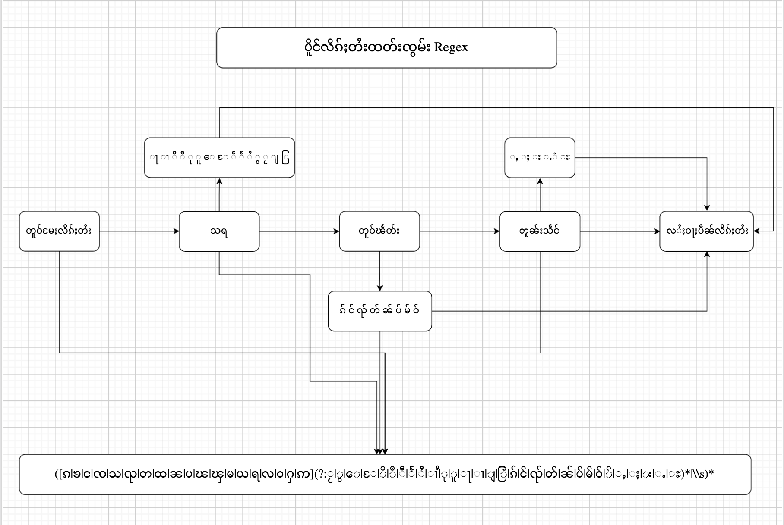
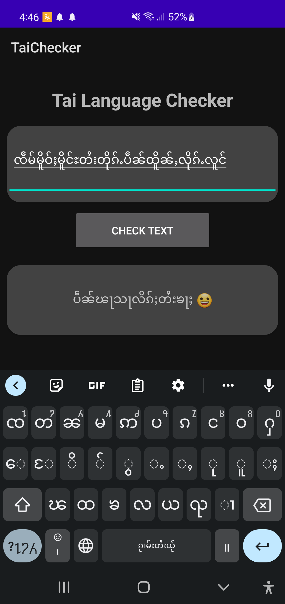
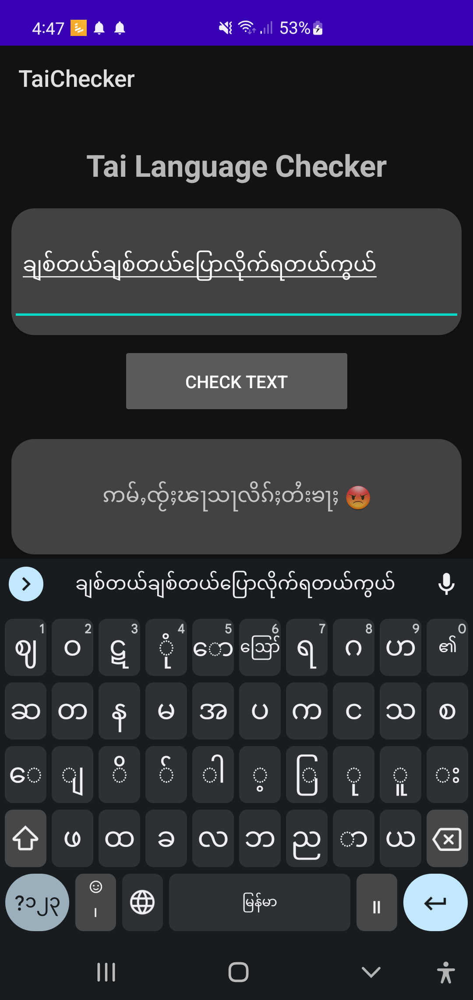

# tailangchecker
Tai Language Checker for Android library

# Theory of regex
I am using the ` a(?:bc)* using ?: we disable the capturing group. ` to check Shan or Tai Language in sentense words. The rule for Tai language in one word are starting with consonants word, follow by vowels or tones. Please look at below diagram for more details.



# How to use TaiLangChecker Library
Step 1. Add the JitPack repository to your build file 
  ```
  allprojects {
		repositories {
			...
			maven { url 'https://jitpack.io' }
		}
	}
  ```
  
Step 2. Add the dependency
  

	dependencies {
	        implementation 'com.github.saitawngpha:tailangchecker:0.0.1'
	}


Step 3. Implementing in your MainActivity
  
    class MainActivity : AppCompatActivity() {

    override fun onCreate(savedInstanceState: Bundle?) {
        super.onCreate(savedInstanceState)
        setContentView(R.layout.activity_main)

        println("###! ${TaiLangChecker.taiLangChecker("ႁဝ်းပဵၼ်")}")
           
    }
    

# Demo
Solarized dark             |  Solarized Ocean
:-------------------------:|:-------------------------:
  |  
